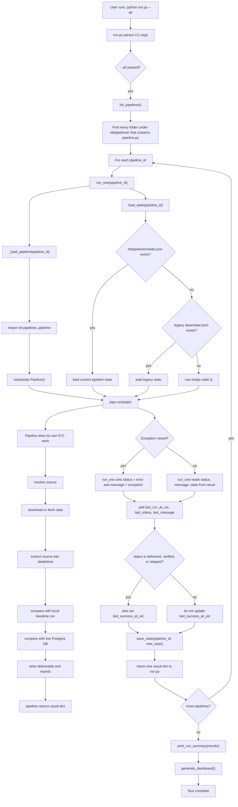

# Pipeline Run Flow

This document describes what happens when the ETL system is started with:

```powershell
python run.py --all
```

Important naming note: there is no `run_one.py` file. The runner calls the `run_one()` function in `etl/core/runner.py`.

## Flowchart



## Step-by-Step

1. `run.py` starts and parses command-line arguments.

2. If `--all` is passed, `run.py` calls `list_pipelines()`.

3. `list_pipelines()` scans `etl/pipelines/` and returns every folder that contains a `pipeline.py` file.

4. `run.py` loops over those pipeline IDs and calls `run_one(pipeline_id)` for each one.

5. `run_one()` calls `_load_pipeline(pipeline_id)`.

6. `_load_pipeline()` dynamically imports:

```python
etl.pipelines.<pipeline_id>.pipeline
```

7. `_load_pipeline()` then creates the pipeline object:

```python
Pipeline()
```

8. `run_one()` calls `load_state(pipeline_id)`.

9. `load_state()` first tries to read:

```text
etl/pipelines/<pipeline_id>/state.json
```

10. If that state file does not exist, `load_state()` tries the legacy path:

```text
data/state/<pipeline_id>.json
```

11. If neither state file exists, the pipeline starts with an empty state:

```python
{}
```

12. `run_one()` calls the actual pipeline:

```python
pipe.run(state)
```

13. Inside `pipe.run(state)`, each pipeline handles its own work:

```text
resolve source -> download/fetch -> extract -> baseline compare -> DB compare -> write deliverable
```

14. The pipeline returns a result dictionary, usually shaped like:

```python
{
    "status": "delivered",
    "message": "...",
    "state": new_state,
}
```

15. If the pipeline raises an exception, `run_one()` catches it and converts it into:

```python
status = "error"
message = str(exception)
```

16. `run_one()` updates the pipeline state with:

```python
last_run_at_utc
last_status
last_message
```

17. If the run was successful enough (`delivered`, `verified`, or `skipped`), `run_one()` also updates:

```python
last_success_at_utc
```

18. `run_one()` saves the updated state back to:

```text
etl/pipelines/<pipeline_id>/state.json
```

19. `run_one()` returns a compact result dict to `run.py`.

20. After all pipelines finish, `run.py` calls `print_run_summary(results)`.

21. `run.py` then calls `generate_dashboard()`.

## Current Responsibility Split

`run.py`

Starts the run, decides whether to run one pipeline or all pipelines, prints the final summary, and regenerates the dashboard.

`etl/core/runner.py`

Discovers pipelines, loads pipeline classes, loads/saves state, catches pipeline exceptions, and builds the run summary.

`etl/core/state.py`

Reads and writes each pipeline's `state.json`.

`etl/pipelines/<pipeline_id>/pipeline.py`

Owns the actual ETL logic for that dataset: source resolution, downloads, extraction, comparison, deliverables, and pipeline-specific state fields.

## Where Logging Fits

Production structured logs should wrap the same flow:

```text
run_started
pipeline_started
pipeline_loaded
state_loaded
source_resolved
source_downloaded
extract_completed
baseline_compare_completed
db_schema_check_completed
db_compare_completed
deliverable_written
state_saved
pipeline_completed
run_completed
```

That keeps the logs aligned with the real execution path instead of inventing a separate mental model.
